# WealthWise — Project Report

**Personal Net Worth, Loan & Expense Manager for the Indian market**
DBMS Experiential Learning — Level 3 Project · SQL + NoSQL (Option 1: PostgreSQL + MongoDB)

| | |
|---|---|
| Team | _Member 1 name, SRN_ · _Member 2 name, SRN_ |
| Repository | `pranaavaltt-a11y/wealth-management` |
| Stack | Next.js 14 (App Router) · TypeScript · PostgreSQL 16 · MongoDB 6+ · Tailwind CSS |
| Database objects | 11 tables · 11 views · 14 functions · 1 stored procedure · 8 triggers · 35 indexes · 41 CHECK constraints · 13 foreign keys · 9 enum types · 4 MongoDB collections |
| Tests | 67 automated tests (28 unit, 39 database integration), all passing |

---

## Contents

1. [Problem statement](#1-problem-statement)
2. [Objectives](#2-objectives)
3. [Scope](#3-scope)
4. [Functional requirements](#4-functional-requirements)
5. [ER diagram](#5-er-diagram)
6. [Relational schema](#6-relational-schema)
7. [Database choice and justification](#7-database-choice-and-justification)
8. [Data dictionary](#8-data-dictionary)
9. [Database implementation](#9-database-implementation)
10. [Important queries](#10-important-queries)
11. [System architecture](#11-system-architecture)
12. [Application screenshots](#12-application-screenshots)
13. [Testing](#13-testing)
14. [Conclusion and future enhancements](#14-conclusion-and-future-enhancements)
15. [Individual contributions](#15-individual-contributions)

---

## 1. Problem statement

An Indian household's financial position is scattered across many places: a
home loan with one bank and a vehicle loan with another, EPF and PPF accounts,
gold held as jewellery and as sovereign gold bonds, mutual funds, fixed
deposits, and a stream of UPI and card payments. Banking apps show one account
at a time. Spreadsheets break as soon as an EMI is paid or a statement arrives.

As a result, people cannot easily answer basic questions:

- What am I actually worth today, and is that going up or down?
- How much of my home loan have I really repaid? (After seven years of a
  twenty-year loan, often less than a fifth of the principal.)
- If I put ₹5 lakh towards the loan, how much interest would I save?
- Where does my money go each month, and which costs are recurring?
- If the RBI raises the repo rate, what happens to my EMIs?

**WealthWise** brings assets, loans, repayment schedules and day-to-day
transactions into one consistent database, and answers these questions with
queries rather than hand calculation.

This is a data-management problem as much as a UI problem. Loans and their
amortisation schedules are tightly constrained, highly relational data where
correctness matters (a missed rupee compounds over 240 installments). Bank
statement imports, receipts and news articles are irregular, semi-structured
data. The project handles each kind with the database paradigm that suits it.

## 2. Objectives

1. Design a normalised relational schema for assets, loans, EMI schedules and
   transactions, with integrity enforced **in the database** through keys, CHECK
   constraints, enum types and triggers, not only in application code.
2. Implement financial logic (EMI amortisation, prepayment, net worth, a derived
   credit score) as **stored functions, procedures and triggers**, so that every
   calculation is visible, explainable and identical wherever it is used.
3. Use **MongoDB** for data that is genuinely schema-flexible (raw statement
   rows, uploaded documents, per-asset-type valuation metadata, cached news) and
   justify that choice rather than using it as a dumping ground.
4. Show **atomicity** where it matters: EMI payments, bulk statement imports
   and loan prepayments either complete entirely or not at all.
5. Provide a **role-based** Next.js web application (Individual and Advisor)
   with dashboards, charts, search, filtering, reports and a downloadable PDF.
6. Back every claim with **automated tests** against a real database.

## 3. Scope

**In scope**

- Asset, loan and transaction management for individuals, with an advisor
  role that can view assigned clients.
- Automatic reducing-balance EMI schedules, payment tracking, overdue detection
  and in-app reminders.
- Bank statement CSV import (HDFC, ICICI, SBI, Axis and Kotak layouts) with
  deduplication and rule-based categorisation; receipt OCR.
- Analytics: net worth trend, asset allocation, cash flow, recurring expenses,
  loan payoff progress, financial-year (April–March) reports with indicative
  Indian tax deductions.
- Smart features: prepayment simulation and application, what-if net worth
  projection, a derived credit score, a loan-product recommendation engine, and
  a news feed showing how rate changes affect the user's own floating-rate
  loans.

**Out of scope, simulated deliberately**

| Real-world dependency | What WealthWise does instead |
|---|---|
| Credit bureau (CIBIL, Experian, Equifax) | A 300–900 score derived **only** from this database's repayment records, labelled as such everywhere it appears |
| Payment gateway or bank mandate | "Mark EMI paid" and "apply prepayment" record the event in the ledger; no money moves |
| Account Aggregator (RBI AA framework) | The user uploads a CSV statement they downloaded themselves |
| Market data feeds | Asset values are user-entered, with the history retained |
| Lender partnerships | A seeded catalogue of publicly advertised rate bands |
| Email or SMS delivery | Reminders are in-app only |

WealthWise is a record-keeping and analysis tool. It gives no financial advice
and stores no real account credentials.

## 4. Functional requirements

| ID | Requirement | Phase | Implemented by |
|---|---|---|---|
| FR-1 | Sign up and log in; passwords hashed; JWT session; two roles | 1 | `auth-service.ts`, bcrypt (12 rounds), httpOnly JWT cookie |
| FR-2 | Create, read, update and delete assets, with liquidity and valuation history | 1 | `assets` table, `asset_valuation_history` (Mongo) |
| FR-3 | Create loans; the full EMI schedule is generated automatically | 1 | `fn_generate_emi_schedule()` inside one transaction |
| FR-4 | Mark an EMI paid, atomically, with a ledger entry and auto-close | 1 | `payInstallment()` transaction |
| FR-5 | Record income and expenses manually | 1 | `transactions` table |
| FR-6 | Net worth dashboard with a historical trend | 2 | `net_worth_snapshots`, trigger, `v_net_worth_summary` |
| FR-7 | Asset allocation chart | 2 | `v_asset_allocation` (window function) |
| FR-8 | Loan payoff progress per loan | 2 | `v_loan_payoff_progress` |
| FR-9 | Net worth refreshed automatically when data changes | 2 | `trg_fn_refresh_net_worth` on 4 tables |
| FR-10 | Upcoming and overdue EMI view | 2 | `v_upcoming_emi_dues`, `fn_mark_overdue_emis()` |
| FR-11 | Bank CSV import: staged, deduplicated, bulk-inserted atomically | 3 | `raw_imports` (Mongo) → one-transaction `UNNEST` insert |
| FR-12 | Receipt photo → extracted merchant, amount and date → expense | 3 | Tesseract OCR (server-side) + confirm step |
| FR-13 | Automatic categorisation with user overrides | 3 | `categorization_rules`, `fn_categorize()` |
| FR-14 | Document vault: upload, tag and search | 3 | `documents` (Mongo) + `$unwind` aggregation |
| FR-15 | Prepayment simulator, with both modes compared | 4 | `fn_simulate_prepayment()`, `sp_apply_prepayment` |
| FR-16 | What-if projection if a loan is closed early | 4 | `fn_project_net_worth()` |
| FR-17 | Derived credit score, recomputed automatically | 4 | `fn_compute_credit_score()` + statement-level triggers |
| FR-18 | Loan product recommendations | 4 | `fn_recommend_loan_products()` |
| FR-19 | News feed with "how does this affect my loans?" | 4 | `news_articles` (Mongo) × floating-rate loans (Postgres) |
| FR-20 | Financial-year reporting (April–March) | 5 | `v_fy_*` views, expression index |
| FR-21 | Downloadable net worth PDF statement | 5 | `statement-pdf.ts` (pdfkit) |
| FR-22 | EMI reminders | 5 | `notifications`, `fn_generate_emi_reminders()` |
| FR-23 | Ledger full-text search | 3 | Generated `tsvector` column + GIN index |
| FR-24 | Advisor view of assigned clients | 4 | `/advisor`, role check before any query |

## 5. ER diagram

The conceptual model in **Chen notation**: rectangles are entities, diamonds
are relationships, ellipses are attributes. A **double rectangle** is a weak
entity and a **double diamond** its identifying relationship. An
**underlined** attribute is a key and a **dashed underline** a partial key. A
**dashed ellipse** is a derived attribute. A **thick line** marks total
participation.


*Source: `docs/diagrams/er-conceptual.dot`, rendered by `npm run docs:generate`.*

### Modelling decisions

**Weak entities.** An *EMI installment* has no identity outside its loan.
"Installment 87" means nothing until you know which loan. It is identified by
the owning loan plus the partial key `installment_no`, through the identifying
relationship *repaid by*. *Net worth snapshot* (user + `snapshot_date`) and
*credit score* (user + `computed_date`) are weak in the same way: one per user
per day.

**Recursive relationship.** *Advises* relates USER to USER. An advisor (role
`advisor`) advises N individual users, and each individual has at most one
advisor.

**Derived attributes.** `outstanding` (on LOAN) and `net_worth` (on the
snapshot) are derived. Outstanding is never stored; it is computed by
`fn_loan_outstanding()` from the last paid installment. Net worth is stored in
snapshots on purpose (see §6.3), and is always recomputed by trigger rather
than written by hand.

**Optional relationships.** A transaction *may* be linked to the asset that
funded it (*funds*) or the loan it settled (*settles*), shown as 0..1. Deleting
the asset or loan sets the link to NULL instead of deleting the ledger history.

**Reference data.** LOAN PRODUCT has no stored relationship to users. The
recommendation engine matches products to a user at query time, so the link is
computed, not persisted.

## 6. Relational schema

### 6.1 Schema diagram

Every table, column, type and foreign key, generated from the live database
catalogue (so it cannot drift from the migrations). Crow's-foot notation:
`>o` marks *zero or more* on the referencing side, and `||` marks *exactly one*
on the referenced side.


### 6.2 ER to relational mapping

| ER construct | Mapped to | Example |
|---|---|---|
| Strong entity | A table with a surrogate key `id BIGINT GENERATED ALWAYS AS IDENTITY` | `users`, `assets`, `loans` |
| 1:N relationship | FK on the N side | `assets.user_id → users.id` |
| Total participation on the N side | FK declared `NOT NULL` | Every asset must have an owner |
| Partial participation | Nullable FK | `transactions.related_loan_id` |
| Weak entity | Table with the owner's FK plus a `UNIQUE (owner, partial key)` constraint, and a surrogate `id` for convenience | `emi_schedule UNIQUE (loan_id, installment_no)` |
| Identifying relationship | `ON DELETE CASCADE` from the owner | Deleting a loan deletes its schedule |
| Recursive 1:N | Self-referencing FK | `users.advisor_id → users.id` |
| Derived attribute | Function or view, not a column | `fn_loan_outstanding()`, `v_net_worth_summary` |
| Attribute with a fixed domain | PostgreSQL `ENUM` type | `loan_type`, `emi_status`, `txn_type` |
| Multi-valued attribute | MongoDB array, where queried | `documents.tags[]` |

The schema in text form:

```
users                (id PK, name, email UQ, password_hash, role, pan_number UQ, advisor_id FK→users, created_at)
assets               (id PK, user_id FK→users, name, asset_type, purchase_value, current_value,
                      purchase_date, valuation_date, notes, liquidity, created_at)
loans                (id PK, user_id FK→users, loan_type, lender, principal, interest_rate, interest_type,
                      tenure_months, start_date, status, created_at)
emi_schedule         (id PK, loan_id FK→loans, installment_no, due_date, emi_amount, principal_component,
                      interest_component, closing_balance, status, paid_date,  UQ(loan_id, installment_no))
loan_prepayments     (id PK, loan_id FK→loans, amount, after_installment, mode, balance_before,
                      balance_after, interest_saved, prepaid_on, created_at)
transactions         (id PK, user_id FK→users, txn_type, amount, txn_date, category, description, source,
                      related_asset_id FK→assets, related_loan_id FK→loans, import_hash, import_batch_id,
                      search_vector GENERATED, created_at)
net_worth_snapshots  (id PK, user_id FK→users, snapshot_date, total_assets, total_liabilities, net_worth,
                      created_at,  UQ(user_id, snapshot_date))
credit_score_history (id PK, user_id FK→users, score, computed_date, factors_json, created_at,
                      UQ(user_id, computed_date))
loan_products        (id PK, lender, product_name, loan_type, interest_rate_min, interest_rate_max,
                      min_credit_score, max_tenure_months, min_amount, max_amount, processing_fee_pct,
                      is_active,  UQ(lender, product_name))
categorization_rules (id PK, user_id FK→users NULL, keyword, category, txn_type, priority, is_active, created_at)
notifications        (id PK, user_id FK→users, kind, title, body, installment_id FK→emi_schedule, due_date,
                      is_read, created_at)
```

### 6.3 Normalisation

Every table is in **third normal form**, and all except the deliberate cases
below are in **BCNF**. The only determinants are keys: a loan's terms depend on
the loan id alone, and an installment's figures on `(loan_id, installment_no)`
alone.

There are three deliberate exceptions, each kept for a stated reason:

| Stored derived data | Why it is kept | How it stays correct |
|---|---|---|
| `net_worth_snapshots.net_worth`, `total_assets`, `total_liabilities` | It is a **historical record**. Yesterday's net worth cannot be recomputed from today's asset values once those values have changed. | Written only by `fn_refresh_net_worth()`, called from triggers; `net_worth` equals assets minus liabilities by construction |
| `emi_schedule.emi_amount`, `closing_balance` | The amortisation table is a **contract**: once an installment is paid, its figures must never change, even if the formula or the loan is later edited | Generated by one function; a paid schedule is locked against regeneration (`WW409`) |
| `transactions.search_vector` | Full-text search needs an indexable `tsvector` | A `STORED` generated column, so the database maintains it and it cannot drift |

## 7. Database choice and justification

The brief asks that each database be chosen for the nature of the data, "not
merely for technology demonstration". Here is the split, and why.

### PostgreSQL — the system of record

Users, assets, loans, the EMI schedule, transactions, snapshots, scores,
products, rules and notifications.

- **The data is relational and tightly constrained.** A loan has exactly one
  owner; an installment belongs to exactly one loan; a payment must reference a
  real installment. These are foreign keys, and violating them is a bug the
  database should refuse.
- **Correctness depends on transactions.** Paying an EMI updates the schedule,
  writes the ledger and may close the loan. A prepayment rewrites a schedule and
  debits an asset. Both need ACID guarantees.
- **The arithmetic belongs next to the data.** `NUMERIC(15,2)` gives exact
  rupee-and-paise arithmetic (no floating-point drift across 240
  installments), and plpgsql lets the EMI formula live in one place.
- **Analytics are relational queries.** Allocation, cash flow, recurring
  expenses and FY reports are GROUP BY, window-function and JOIN queries.

### MongoDB — schema-flexible documents

| Collection | Why it is a document, not a row |
|---|---|
| `raw_imports` | Each bank's CSV has different columns. The raw rows are kept verbatim for audit, before normalisation. Forcing them into one table would mean either losing columns or a wide, mostly-NULL table. |
| `asset_valuation_history` | What matters differs by asset class: gold has grams, purity and rate per gram; property has square feet, city and circle rate; equity has units and NAV. One document per valuation fits; the relational alternatives are a sparse table or an EAV design. |
| `documents` | Uploaded files carry irregular metadata (survey numbers on a deed, a GSTIN on a receipt) and a free-form `tags[]` array that is queried directly. |
| `news_articles` | Feed items are semi-structured; rate fields are present on some articles and absent on most. |

The two databases are linked deliberately. `transactions.import_batch_id`
holds the Mongo `ObjectId` of the staged import. Postgres cannot enforce a
foreign key across that boundary, which is documented in a column comment. The
news feature runs a **cross-database query**: the rate change comes from a
Mongo document, and the affected loans come from Postgres.

### Why not a vector database

§3 of the brief offers SQL + NoSQL **or** SQL + vector; this project takes the
first. §8 recommends embeddings for unstructured, text-heavy data. WealthWise's
data is overwhelmingly numeric and relational: amounts, rates, dates and
schedules. Its one text-heavy collection, cached news, is served well by
category and tag filters. Adding embeddings would be technology for its own
sake, which §18 warns against.

## 8. Data dictionary

The full data dictionary is generated from the live catalogue: every column's
type, nullability, default and key role, plus every CHECK constraint and every
index with its definition.

**→ [`docs/DATA_DICTIONARY.md`](DATA_DICTIONARY.md)**

Summary of what the database enforces:

| Rule | Mechanism |
|---|---|
| All money is exact | `NUMERIC(15,2)` everywhere, never `float` |
| Amounts are positive; direction is in `txn_type` | `CHECK (amount > 0)` |
| Rates are sane | `CHECK (interest_rate > 0 AND interest_rate <= 60)` |
| PAN is well-formed | `CHECK (pan_number ~ '^[A-Z]{5}[0-9]{4}[A-Z]$')` |
| Emails are lowercase and unique | `CHECK (email = lower(email))` + `UNIQUE` |
| A paid installment has a paid date, an unpaid one does not | Multi-column `CHECK emi_paid_date_consistency` |
| Asset valued no earlier than purchase, and not in the future | `CHECK` constraints, the second added via `ALTER` |
| Prepayment arithmetic adds up | `CHECK (balance_after = balance_before - amount)` |
| One snapshot / one score per user per day | `UNIQUE (user_id, snapshot_date)`, `UNIQUE (user_id, computed_date)` |
| No duplicate imported transactions | Partial unique index on `(user_id, import_hash)` |
| No duplicate system rules (NULL ≠ NULL) | Partial unique index on `upper(keyword) WHERE user_id IS NULL` |
| Payment history is never erased | `fn_generate_emi_schedule` raises `WW409` once anything is paid |

## 9. Database implementation

Eight migrations, applied in order by a transactional runner
(`scripts/migrate.ts`). Each file runs in its own transaction and is recorded in
`schema_migrations`.

| Migration | Contents |
|---|---|
| `001_core_schema` | 8 tables, 8 enum types, keys, CHECK constraints, cascade rules |
| `002_indexes` | Indexes, each annotated with the query that justifies it |
| `003_emi_functions` | `fn_calculate_emi`, `fn_generate_emi_schedule`, `fn_loan_outstanding` |
| `004_networth_trigger` | `fn_refresh_net_worth` + one trigger body on three tables |
| `005_alters_and_views` | `ALTER TABLE … ADD COLUMN liquidity`, `ADD CONSTRAINT`, `DROP/CREATE TRIGGER`; 7 reporting views |
| `006_import_and_search` | Categorisation rules + `fn_categorize`; cross-DB `import_batch_id`; generated `tsvector` + GIN |
| `007_fix_recategorize` | Fix found by testing (see §13.3) |
| `008_smart_features` | Prepayment (function + procedure), credit score + statement triggers, recommendations, projection, FY views + expression index, notifications |

### 9.1 DDL coverage

| Statement | Where |
|---|---|
| `CREATE TABLE / TYPE / INDEX / VIEW / FUNCTION / PROCEDURE / TRIGGER` | Throughout |
| `ALTER TABLE … ADD COLUMN` | `assets.liquidity`, `transactions.import_batch_id`, `transactions.search_vector` |
| `ALTER TABLE … ADD / DROP CONSTRAINT` | `assets_valuation_not_in_future` |
| `DROP TRIGGER / DROP SCHEMA` | Trigger narrowing in 005 and 008; `migrate --reset` |

### 9.2 Advanced features (the brief asks for at least four)

| # | Feature | Implementation |
|---|---|---|
| 1 | **Transactions** | EMI payment, loan creation and schedule, bulk CSV import, prepayment: each is one atomic unit with rollback tested |
| 2 | **Stored functions** | 14, including EMI, amortisation, prepayment simulation, credit score, recommendations, projection, categorisation |
| 3 | **Stored procedure** | `sp_apply_prepayment`, called with `CALL`, using row locks (`FOR UPDATE`) and an `INOUT` parameter |
| 4 | **Triggers** | Row-level net worth refresh on 4 tables; **statement-level triggers with transition tables** for the credit score |
| 5 | **Views** | 11 reporting views: net worth, dues, allocation, payoff, cash flow, category spend, recurring expenses (HAVING), 4 FY views |
| 6 | **Indexing** | 35 indexes, including **partial**, **partial unique**, **expression** (on an IMMUTABLE function) and **GIN** indexes |
| 7 | **Full-text search** | Generated `tsvector` column, weighted A/B, GIN index, `websearch_to_tsquery` |
| 8 | **NoSQL aggregation** | `$group`, `$unwind`, `$project` and `$sort` pipelines over imports, documents and news |
| 9 | **Window functions** | `SUM(SUM(…)) OVER (PARTITION BY …)`, `LAG()`, running totals |

### 9.3 Index justification (selection)

| Index | Type | Query it serves |
|---|---|---|
| `idx_emi_due_pending` | **Partial**, `WHERE status IN ('pending','overdue')` | The upcoming-dues query. Paid rows, the vast majority over time, are excluded, so the index stays small. |
| `idx_txn_import_hash` | **Partial unique** | Makes import deduplication a database guarantee; manual rows (NULL hash) are unconstrained |
| `idx_catrule_system_keyword` | **Partial unique** on `upper(keyword)` | Stops duplicate system rules, which a plain `UNIQUE` misses because NULL ≠ NULL |
| `idx_txn_user_fy` | **Expression** on `fn_fy_start_year(txn_date)` | FY reports filter on the computed year, which an index on `txn_date` cannot serve. Verified with `EXPLAIN`. |
| `idx_txn_search` | **GIN** on `search_vector` | Full-text ledger search. Verified with `EXPLAIN`. |
| `idx_txn_user_date` | Composite `(user_id, txn_date DESC)` | The ledger, newest first: filter and sort from one index |
| `idx_notif_unread` | Partial, `WHERE NOT is_read` | The bell badge count |

### 9.4 MongoDB data model

```js
raw_imports             { _id, userId, sourceBank, fileName, fileType, rawRows: [[…]], rowCount,
                          parsedAt, matchStatus: 'staged'|'committed'|'reverted', committedAt, insertedCount }
asset_valuation_history { userId, assetId, valuationDate, value,
                          typeSpecificMetadata: { grams, purity, ratePerGram } | { sqft, city } | … }
documents               { _id, userId, refType: 'loan'|'asset'|'general', refId, title, fileName,
                          originalName, fileUrl, mimeType, sizeBytes, checksum, tags: [ … ], uploadedAt }
news_articles           { _id, headline, source, category, tags: [ … ], body, url, publishedAt,
                          relatedRateType, rateChangeBps, isSample, fetchedAt }
```

**Retrieval strategy.** Every document query filters on `userId` first.
Imports are listed by `parsedAt` descending. Documents are searched by an
escaped, case-insensitive regex over title, filename and tags. News is cached
with a 6-hour TTL and refreshed lazily on read (or by a cron hitting
`POST /api/news/refresh`), upserting by article URL so re-fetches never
duplicate.

**Aggregation pipelines:**

```js
// Vault: count each tag independently — $unwind flattens the tags array
[{ $match: { userId } }, { $unwind: '$tags' },
 { $group: { _id: '$tags', count: { $sum: 1 } } }, { $sort: { count: -1 } }]

// Imports: per-bank statistics
[{ $match: { userId } },
 { $group: { _id: '$sourceBank', imports: { $sum: 1 }, totalRows: { $sum: '$rowCount' },
             committed: { $sum: { $cond: [{ $eq: ['$matchStatus', 'committed'] }, 1, 0] } } } }]
```

## 10. Important queries

Every query below is in the repository verbatim. The application has no ORM,
so these are the actual statements it runs.

**Q1. EMI by the reducing-balance formula** (`fn_calculate_emi`)

E = P · r · (1+r)ⁿ / ((1+r)ⁿ − 1), where r = annual rate / 12 / 100.

```sql
v_monthly_rate := p_annual_rate / 12 / 100;
v_growth       := POWER(1 + v_monthly_rate, p_tenure_months);
RETURN ROUND(p_principal * v_monthly_rate * v_growth / (v_growth - 1), 2);
```
₹50,00,000 at 8.50% over 240 months gives **₹43,391.16**, and the generated
principal components sum to exactly ₹50,00,000.00 (§13).

**Q2. Asset allocation: GROUP BY with a window over the aggregate** (`v_asset_allocation`)

```sql
SELECT user_id, asset_type, SUM(current_value) AS current_value,
       ROUND(100.0 * SUM(current_value)
             / NULLIF(SUM(SUM(current_value)) OVER (PARTITION BY user_id), 0), 2) AS allocation_pct
  FROM assets GROUP BY user_id, asset_type;
```
`SUM(SUM(…)) OVER` is each user's grand total, evaluated *after* grouping. A
plain subquery cannot do that in the same pass.

**Q3. Recurring expenses: HAVING on an aggregate** (`v_recurring_expenses`)

```sql
SELECT user_id, category, COUNT(DISTINCT date_trunc('month', txn_date)) AS months_seen,
       ROUND(SUM(amount) / NULLIF(COUNT(DISTINCT date_trunc('month', txn_date)), 0), 2) AS monthly_run_rate
  FROM transactions
 WHERE txn_type = 'expense' AND txn_date >= CURRENT_DATE - INTERVAL '12 months'
 GROUP BY user_id, category
HAVING COUNT(DISTINCT date_trunc('month', txn_date)) >= 3;
```
`WHERE` cannot express "appeared in three months", because `WHERE` runs before
grouping.

**Q4. Loan summary: one pass with FILTER** (`v_loan_payoff_progress`, excerpt)

```sql
SELECT l.id, COUNT(e.id) FILTER (WHERE e.status = 'paid')            AS paid_installments,
       SUM(e.interest_component) FILTER (WHERE e.status = 'paid')      AS interest_paid,
       MIN(e.due_date) FILTER (WHERE e.status <> 'paid')              AS next_due_date,
       fn_loan_outstanding(l.id)                                      AS outstanding
  FROM loans l LEFT JOIN emi_schedule e ON e.loan_id = l.id GROUP BY l.id;
```

**Q5. Atomic bulk import** (`commitImport`, run inside `BEGIN … COMMIT`)

```sql
INSERT INTO transactions (user_id, txn_type, amount, txn_date, category, description, source, import_hash, import_batch_id)
SELECT $1, t.txn_type::txn_type, t.amount, t.txn_date::date, t.category, t.description, 'import', t.import_hash, $8
  FROM UNNEST($2::text[], $3::numeric[], $4::text[], $5::text[], $6::text[], $7::text[])
       AS t(txn_type, amount, txn_date, category, description, import_hash)
ON CONFLICT (user_id, import_hash) WHERE import_hash IS NOT NULL DO NOTHING
RETURNING txn_type, amount;
```
One statement for the whole statement file, with deduplication guaranteed by
the partial unique index rather than by application logic.

**Q6. Categorisation with precedence in ORDER BY** (`fn_categorize`)

```sql
SELECT r.category, r.txn_type, r.keyword FROM categorization_rules r
 WHERE r.is_active AND (r.user_id = p_user_id OR r.user_id IS NULL)
   AND upper(p_description) LIKE '%' || upper(r.keyword) || '%'
 ORDER BY (r.user_id IS NOT NULL) DESC, r.priority, length(r.keyword) DESC
 LIMIT 1;
```

**Q7. Statement-level trigger with transition tables** (credit score)

```sql
CREATE TRIGGER trg_emi_credit_score AFTER UPDATE ON emi_schedule
  REFERENCING OLD TABLE AS old_rows NEW TABLE AS new_rows
  FOR EACH STATEMENT EXECUTE FUNCTION trg_fn_credit_score_emi();
-- body:  FOR r IN SELECT DISTINCT l.user_id FROM new_rows n JOIN old_rows o ON o.id = n.id
--                 JOIN loans l ON l.id = n.loan_id WHERE o.status IS DISTINCT FROM n.status ...
--        LOOP PERFORM fn_compute_credit_score(r.user_id); END LOOP;
```
Marking 24 EMIs paid in one `UPDATE` rescores the user **once**, not 24 times.
This is tested.

**Q8. Prepayment as a stored procedure, with row locks** (`sp_apply_prepayment`, outline)

```sql
SELECT l.lender INTO v_lender FROM loans l
 WHERE l.id = p_loan_id AND l.user_id = p_user_id AND l.status = 'active' FOR UPDATE;
UPDATE assets SET current_value = current_value - p_amount WHERE id = p_from_asset_id;
SELECT array_agg(s ORDER BY s.installment_no) INTO v_rows FROM fn_simulate_prepayment(p_loan_id, p_amount, p_mode) s;
DELETE FROM emi_schedule WHERE loan_id = p_loan_id AND status <> 'paid';
INSERT INTO emi_schedule (...) SELECT ... FROM unnest(v_rows) r;
INSERT INTO loan_prepayments (...) VALUES (...);   -- CHECK verifies the arithmetic
INSERT INTO transactions (...) VALUES (...);
```
Called as `CALL sp_apply_prepayment($1,$2,$3,$4,$5,NULL)`. Net worth is
unchanged afterwards, because the asset and the liability fall by the same
amount. That is tested too.

**Q9. Recommendation engine: CROSS JOIN profile × catalogue** (`fn_recommend_loan_products`, excerpt)

```sql
WITH profile AS (SELECT <latest score>, <avg monthly income>, <existing EMI burden>),
     priced  AS (SELECT p.*, pr.*, <rate interpolated in band by score> AS est_rate
                   FROM loan_products p CROSS JOIN profile pr WHERE p.is_active AND p.loan_type = $2)
SELECT ..., (score >= min_credit_score AND amount BETWEEN min_amount AND max_amount
             AND (existing_emi + emi) / monthly_income <= 0.5) AS eligible,
       40*rate_term + 25*score_headroom + 15*fee_term + 20*affordability AS match_score
  FROM costed ORDER BY eligible DESC, match_score DESC;
```

**Q10. Advisor triage: JOIN + LATERAL + correlated subquery** (`advisorClients`)

```sql
SELECT u.id, u.name, s.net_worth, s.debt_to_asset_pct, cs.score,
       (SELECT COUNT(*) FROM v_upcoming_emi_dues d WHERE d.user_id = u.id AND d.urgency = 'overdue') AS overdue
  FROM users u
  JOIN v_net_worth_summary s ON s.user_id = u.id
  LEFT JOIN LATERAL (SELECT c.score FROM credit_score_history c
                      WHERE c.user_id = u.id ORDER BY c.computed_date DESC LIMIT 1) cs ON TRUE
 WHERE u.advisor_id = $1 ORDER BY overdue DESC, u.name;
```

**Q11. Full-text search ranked by relevance** (`listTransactions`)

```sql
SELECT ... FROM transactions
 WHERE user_id = $1 AND ($6::text IS NULL OR search_vector @@ websearch_to_tsquery('english', $6))
 ORDER BY CASE WHEN $6::text IS NULL THEN 0
               ELSE ts_rank(search_vector, websearch_to_tsquery('english', $6)) END DESC, txn_date DESC;
```

**Q12. Cross-database query: news × floating-rate loans** (`rateImpact`)

The rate change in basis points comes from a MongoDB article, then:

```sql
SELECT l.lender, fn_calculate_emi(o.outstanding, l.interest_rate,             r.remaining::int) AS old_emi,
                 fn_calculate_emi(o.outstanding, l.interest_rate + $2/100.0,  r.remaining::int) AS new_emi
  FROM loans l
 CROSS JOIN LATERAL (SELECT fn_loan_outstanding(l.id) AS outstanding) o
 CROSS JOIN LATERAL (SELECT COUNT(*) AS remaining FROM emi_schedule e
                      WHERE e.loan_id = l.id AND e.status <> 'paid') r
 WHERE l.user_id = $1 AND l.status = 'active' AND l.interest_type = 'floating';
```

## 11. System architecture

```
 Browser ── Next.js pages (React, server + client components)
               │   components never query a database; they call /api/*
               ▼
           API layer — src/app/api/**/route.ts (35 route handlers)
               │   auth (JWT cookie) · role checks · Zod validation · error mapping
               ▼
           Service layer — src/lib/services/*.ts
               │   auth, CSV parsing, OCR, import orchestration, vault, news, PDF
               ▼
           Data-access layer — src/lib/db/*.ts (one module per entity, raw SQL, no ORM)
               │
        ┌──────┴────────────────────────────┐
        ▼                                   ▼
   PostgreSQL 16                        MongoDB
   tables, constraints, functions,      raw_imports, documents,
   procedure, triggers, views           valuation history, news cache
```

- **Layering is strict.** No React component issues a query, and no route
  handler contains inline SQL.
- **No ORM.** Postgres is reached through `pg` with parameterised SQL, so every
  query in §10 is visible and explainable as written.
- **Errors carry status from the database.** Stored routines raise SQLSTATEs of
  the form `WWnnn`, and the API maps `WW409` to HTTP 409, `WW404` to 404 and so
  on, so business-rule violations reach the user as clear messages rather than
  500s.
- **Mongo is optional at runtime.** If it is unreachable, imports still
  complete (without the raw audit copy), the news feed serves labelled sample
  data, and the vault shows an explicit "MongoDB not reachable" panel. A failed
  connection is cached for 60 seconds so requests do not stall.

### Security

| Concern | Measure |
|---|---|
| Passwords | bcrypt, 12 rounds; never logged or returned |
| Sessions | HS256 JWT in an `httpOnly`, `sameSite=lax` cookie, so it cannot be read by script |
| Account enumeration | Identical message and comparable timing for "no such user" and "wrong password" |
| Authorisation | Ownership in the `WHERE` clause (`… AND user_id = $2`), with no check-then-act gap; advisors limited to assigned clients |
| SQL injection | Every query parameterised; optional filters use `($n IS NULL OR col = $n)` instead of string building |
| Uploads | MIME allowlist, size limits, generated filenames (never user-supplied paths) |
| Secrets | All credentials from environment variables; `.env` is gitignored |
| PII | PAN is masked on the PDF statement |
| Privacy | Receipt OCR runs on the server with a bundled model; images never leave it |

## 12. Application screenshots

| | |
|---|---|
| 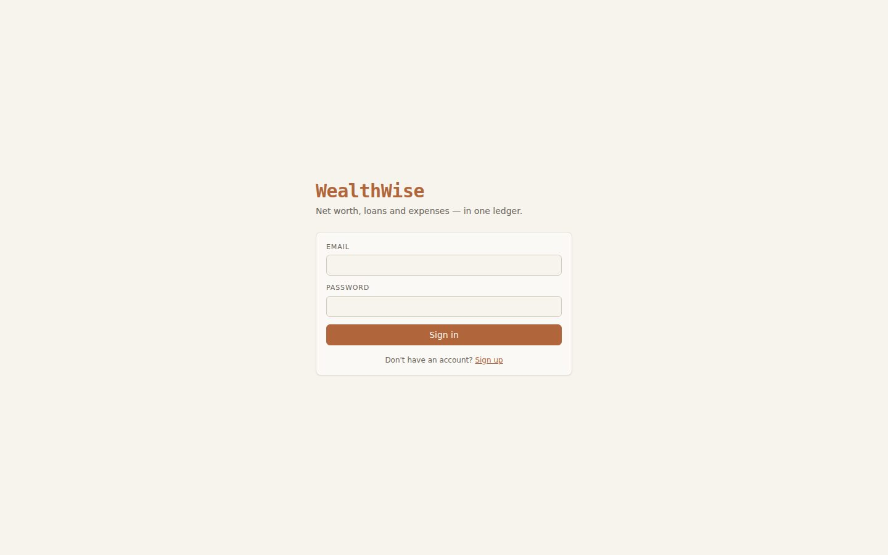 **Login** | 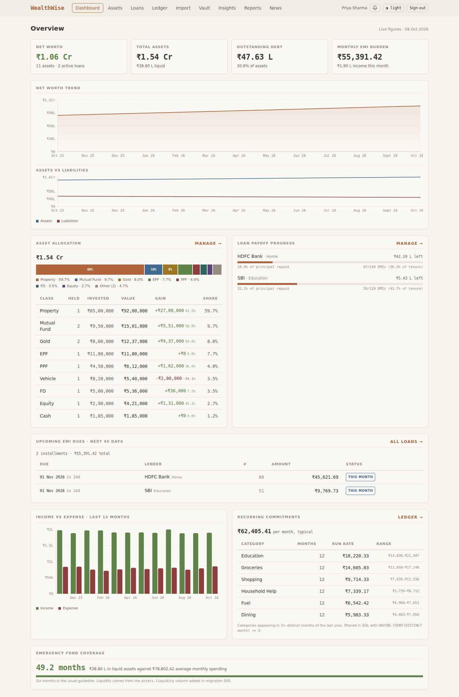 **Dashboard** — net worth trend, allocation, payoff, dues, cash flow, recurring costs |
| 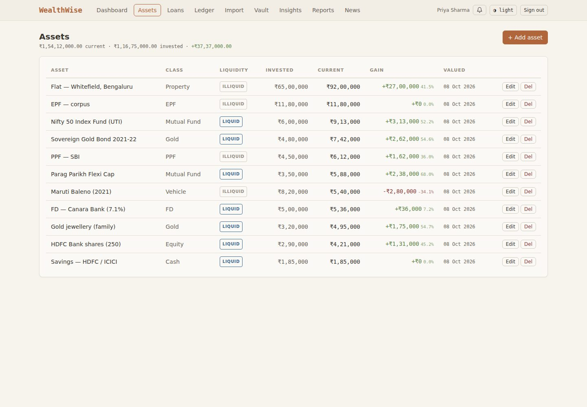 **Assets** with liquidity | 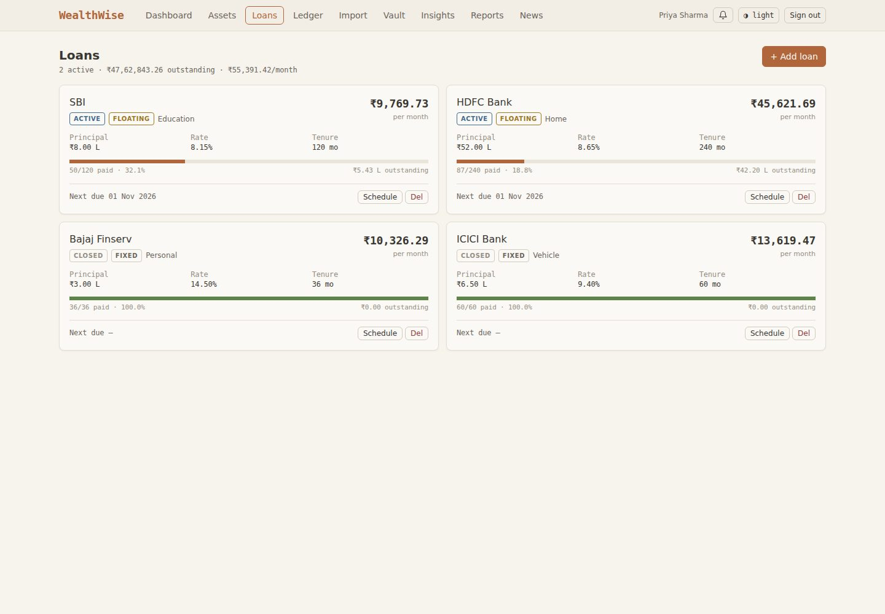 **Loans** with progress |
| 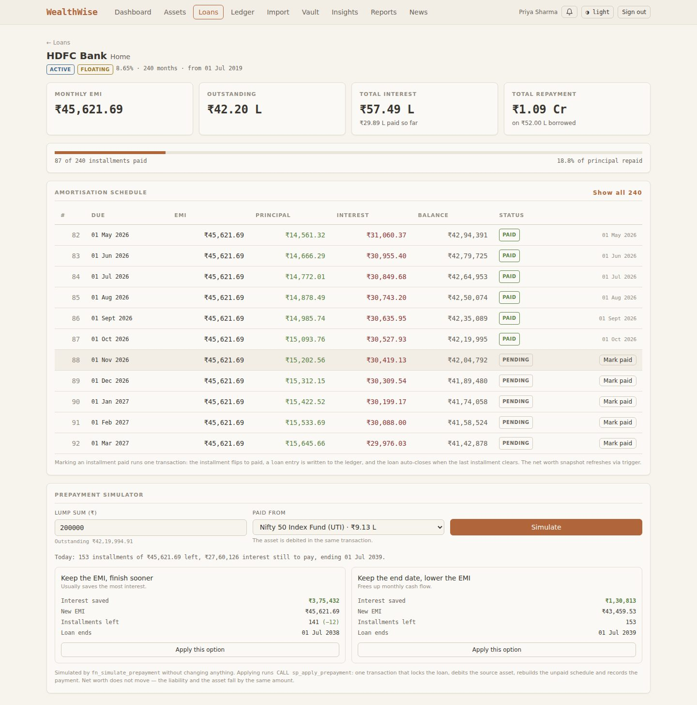 **Amortisation schedule + prepayment simulator** | 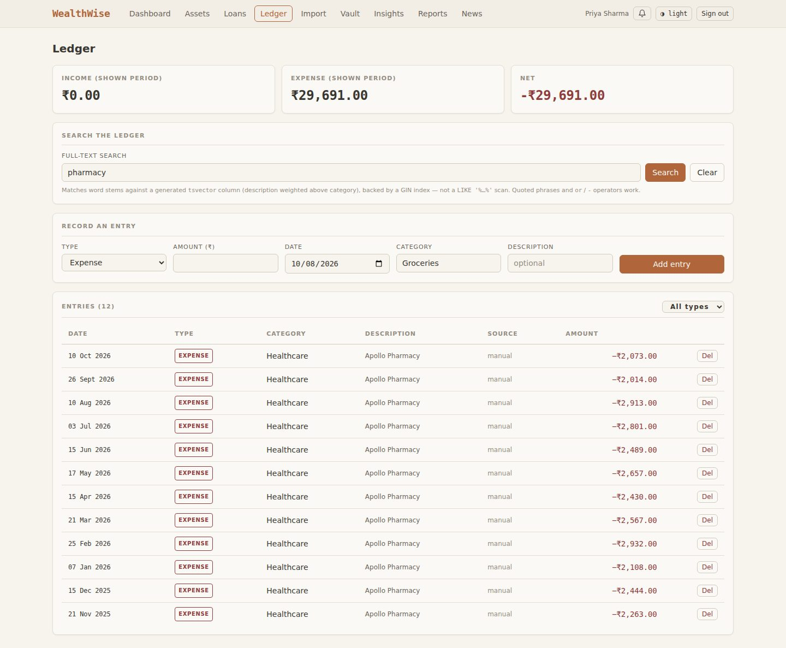 **Ledger** with full-text search |
| 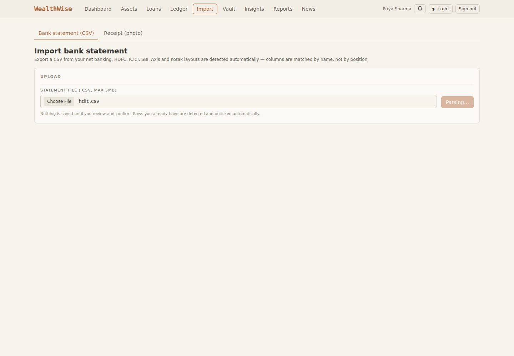 **Statement import** — auto-categorised preview | 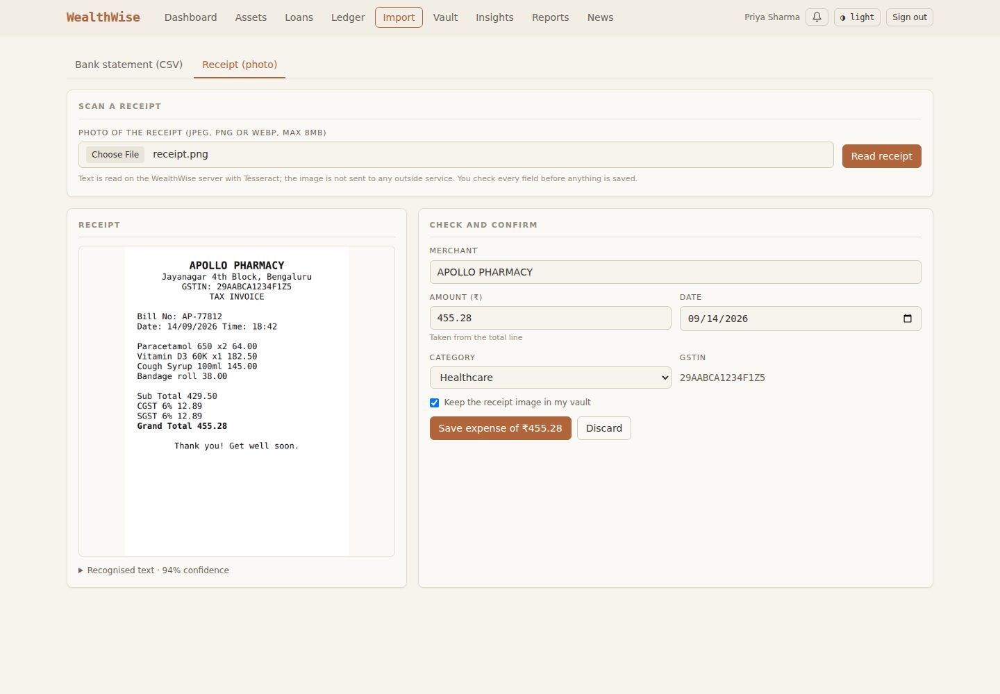 **Receipt OCR** — fields extracted for confirmation |
| 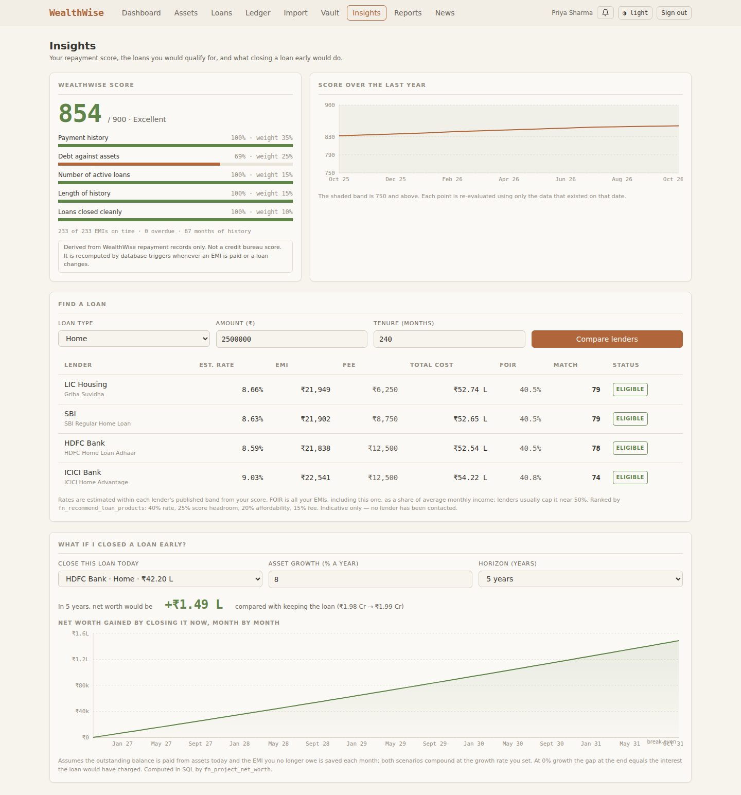 **Insights** — score, lender comparison, what-if | 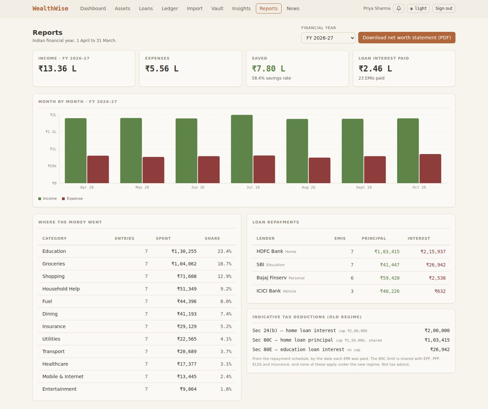 **FY report** with tax hints and PDF download |
| 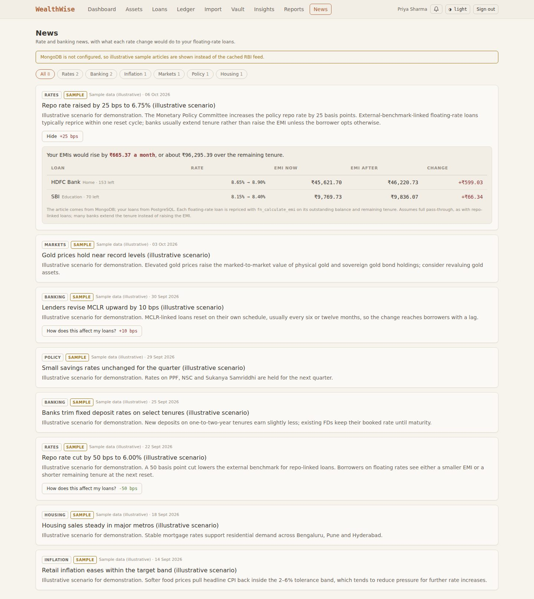 **News** — rate change applied to the user's loans | 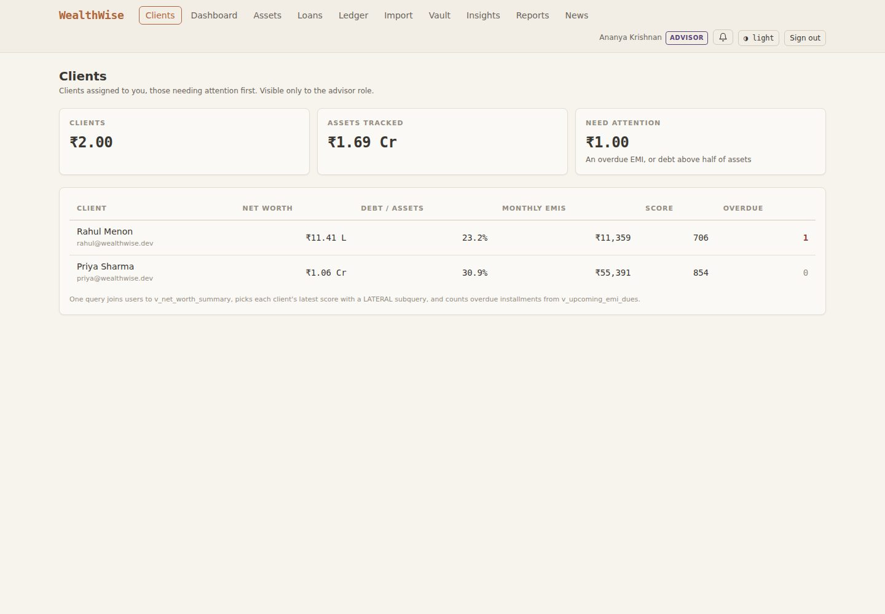 **Advisor** — client triage |
| 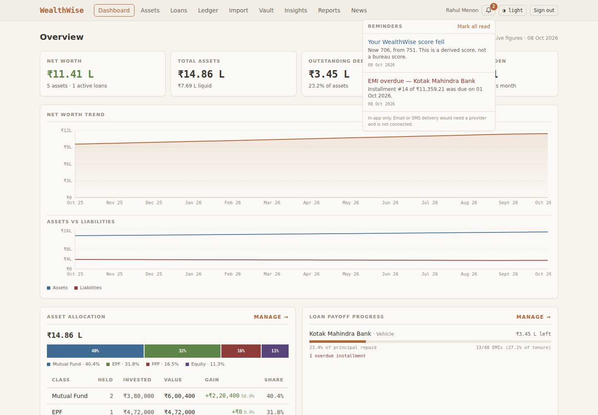 **Reminders** | 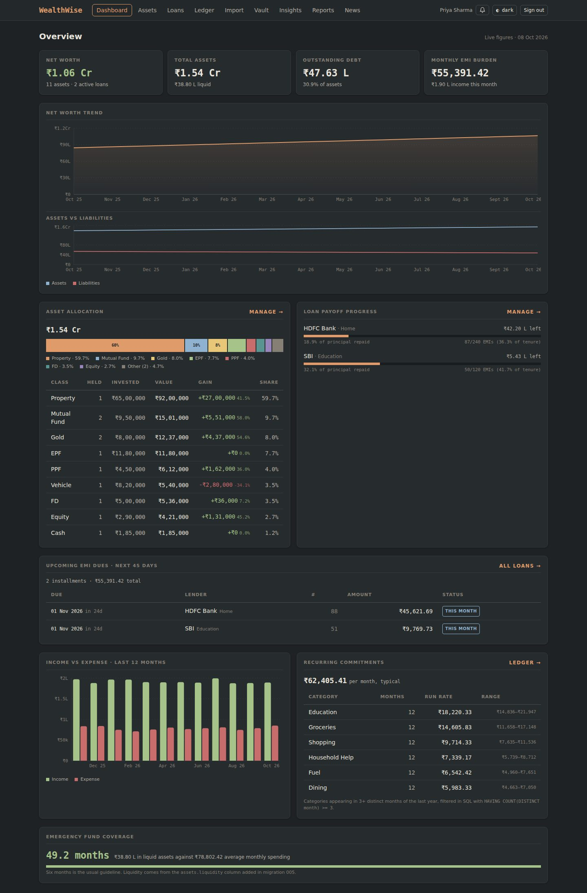 **Dark theme** |

## 13. Testing

### 13.1 Automated suite

```
npm test        # = npm run test:unit && npm run test:db
```

Database tests run against a separate `wealthwise_test` database, rebuilt from
the migrations before every run, so they never touch demo data. Each test file
creates its own users, so files share no state.

| Suite | Tests | Covers |
|---|---|---|
| CSV reader, dates, amounts, header detection, normalisation | 17 | Quoted commas, Indian grouping, `31/02` rejection, dedupe hash |
| Receipt extraction, news classification, RSS parsing | 11 | Grand Total over Sub Total, month-name dates, rate-change direction |
| Integrity constraints | 5 | Negative amounts, rates > 60%, bad PAN, paid-without-date, duplicate email |
| EMI functions | 4 | Formula value, zero-interest case, exact principal sum, schedule lock |
| Atomic EMI payment | 4 | Ledger + outstanding, double-pay refused, cross-user refused, auto-close |
| Net worth trigger | 2 | Asset and loan inserts refresh the snapshot |
| Statement import | 4 | Categorisation, re-import inserts 0, **mid-batch failure rolls back everything**, revert |
| Categorisation rules | 3 | User rule beats system rule; duplicate system rule refused; retroactive sweep |
| Full-text search | 2 | Stemming; planner uses the GIN index |
| Credit score | 3 | Range and disclaimer; overdue lowers it; **statement trigger fires once for 24 rows** |
| Prepayment | 5 | Tenure mode beats EMI mode; over-payment refused; **net worth unchanged**; **under-funded rolls back**; cross-user refused |
| Recommendations | 1 | Ineligible below the minimum score, with reason; eligible ranked first |
| What-if projection | 1 | At 0% growth, the gain equals the remaining interest exactly |
| Financial year | 2 | 31 Mar vs 1 Apr boundary; view splits correctly |
| Views | 2 | HAVING keeps only 3+ month categories; zero row for an empty user |
| Reminders | 1 | Generated once, idempotent on re-run |
| **Total** | **67** | **67 passed, 0 failed** |

Full output, test by test: [`docs/test-results.txt`](test-results.txt).

### 13.2 End-to-end verification

Beyond the automated suite, every API endpoint was exercised over HTTP against
the running application, and every page was checked by screenshot in both
themes. Selected results:

| Check | Result |
|---|---|
| ₹5L prepayment on the seeded ₹52L home loan, seven years in | Saves ₹8.51L interest and 29 months (reduce tenure) vs ₹3.27L (reduce EMI) |
| Same prepayment funded from an FD | Net worth unchanged to the paisa; FD and liability both fall ₹3L |
| Edit a loan that has payments | HTTP 409, with a hint to use prepayment instead |
| Pay or prepay another user's loan | 404 / no change |
| Individual calls the advisor API | 403 |
| Re-import the same bank statement | 0 inserted, 10 reported as duplicates |
| Confirm the same receipt twice | 201, then 409 |
| Receipt OCR on a pharmacy bill | 94% confidence, 1.5 s; merchant, ₹455.28, date and GSTIN all correct |
| +25 bps repo rate on the seeded user | EMIs +₹665.37 a month, about ₹96,295 over the remaining tenure |
| PDF statement | 2 pages, embedded fonts, 83 ₹ glyphs rendered, PAN masked |

### 13.3 Defects found by testing, and fixed

Testing found real defects, not only confirmed working code:

1. **`UPDATE … FROM LATERAL` referencing the update target.** Postgres rejects
   this; the original `fn_recategorize_user` failed on first use. Replaced with
   a correlated subquery in migration 007.
2. **Prepayment created net worth from nothing.** The first version lowered the
   liability without debiting the cash that paid it, so net worth jumped by the
   full prepayment. The procedure now debits a named source asset in the same
   transaction, and a test asserts net worth is unchanged.
3. **Projection overstated the benefit.** It assumed every remaining EMI equalled
   the next one, which is wrong after a reduce-tenure prepayment (the last EMI is
   smaller). It now sums the actual schedule; the 0%-growth test pins it exactly.
4. **Editing a paid loan would erase its payment history.** Schedule
   regeneration deleted every row. It is now refused at the database level
   (`WW409`).
5. **Form validation blocked valid input.** `min=1 step=1000` made ₹25,00,000
   invalid in the browser, so the lender comparison never submitted. Found by
   screenshot review.
6. **PDF spilled onto blank pages.** Footers drawn inside the bottom margin
   triggered page breaks (6 pages instead of 2).
7. **Charts.** Two asset classes shared one grey; an axis printed "₹2L" twice;
   "₹50k" rendered as "₹5k"; and a two-line projection chart was unreadable at
   scale, so it was redrawn to plot the difference.

### 13.4 Chart accessibility

Chart colours were checked with a colour-vision-deficiency validator, not
chosen by eye. The seven-hue categorical palette measures ΔE 10.1 / 9.8
(dark / light) under deuteranopia simulation and 18.3 for normal vision, with
contrast passing in both themes. Every chart also has a legend, direct labels
or a data table, so colour is never the only channel.

## 14. Conclusion and future enhancements

WealthWise shows that a personal-finance application is a strong test of
database design. The domain needs exact arithmetic, strict integrity and
atomic multi-table updates, which suit a relational database, alongside
irregular documents and feeds, which suit a document store. Putting the
financial logic in the database (amortisation in a function, prepayment in a
procedure, net worth and scores maintained by triggers, reporting in views)
made it explainable and testable: the same EMI figure appears on the schedule,
the dashboard, the PDF and the news impact, because one function computes all
of them.

**Future enhancements**

- **Account Aggregator integration** (RBI AA framework) to replace manual CSV
  upload with consented bank data.
- **Partitioning** `transactions` by financial year (`PARTITION BY RANGE`)
  once volumes grow; the expression index already aligns with that key.
- **Row-level security** policies, so tenant isolation is enforced by Postgres
  itself, in addition to the application's `WHERE user_id = …` clauses.
- **Materialised views** with scheduled refresh for advisor-wide analytics
  over many clients.
- **Semantic search over documents and news** using `pgvector`, should
  unstructured content grow enough to warrant it.
- **Email and SMS reminders** through a delivery provider, and a real
  scheduler in place of refresh-on-read.
- **Cloud OCR** as an opt-in fallback for low-confidence photographed receipts.
- **Floating-rate resets** applied automatically from the news feed to
  repo-linked loans.

## 15. Individual contributions

> **To be completed by the team.** The brief (§2, §15, §16) requires each
> member's contribution to be visible in the commit history. Fill in this table,
> and make sure each member commits their own work under their own Git identity.

| Area | Member | Key files |
|---|---|---|
| Relational schema, constraints, indexes | | `db/migrations/001`, `002` |
| EMI functions, triggers, views | | `003`, `004`, `005` |
| Import, categorisation, full-text search | | `006`, `src/lib/services/csv-parser.ts`, `src/lib/db/imports.ts` |
| Smart features (prepayment, score, recommendations, projection) | | `008`, `src/lib/db/insights.ts` |
| MongoDB model and aggregation (vault, imports, news) | | `src/lib/db/mongo.ts`, `src/lib/services/*-service.ts` |
| API layer, auth and roles | | `src/app/api/**`, `src/lib/auth/**` |
| UI, design system, charts | | `src/components/**`, `src/app/globals.css` |
| OCR and PDF statement | | `ocr-service.ts`, `statement-pdf.ts` |
| Tests | | `tests/**` |
| Documentation | | `README.md`, `docs/**` |
